💼 Visit my portfolio at: [hegdeatri.com/about](https://hegdeatri.com/about).

I also have a few projects on my [GitLab profile](https://gitlab.com/hegde-atri).

Founder @ [LiteSite Limited](https://litesite.uk).

Some of my cool projects
- [life-os](https://github.com/hegde-atri/life-os): Gamified task management application enhanced with AI.
- Website for [HADM](https://hadm.co.uk).
- [nextjs-starter-activity](https://github.com/hegde-atri/nextjs-starter-activity) and [nextjs-todo-app](https://github.com/hegde-atri/nextjs-todo-app): A guide to getting started with nextjs and then the T3 stack.
- [hypr-helper](https://gitlab.com/hegde-atri/hypr-helper): A CLI tool simplifying events from hyprland UNIX socket.
- Banking Application - [frontend](https://github.com/hegde-atri/BankingApplication-fe) and [backend](https://github.com/hegde-atri/BankingApplication-be)

Currently working on:
- [nix-ros2](https://github.com/hegde-atri/nix-ros2)
- [nixos-config](https://github.com/hegde-atri/nixos-config)
- [org-mode-latex-templates](https://github.com/hegde-atri/org-mode-latex-templates)

Plan to work on:
- [arustbar](https://gitlab.com/hegde-atri/arustbar)
- [Movie Critic Website](https://github.com/hegde-atri/movie-rating)
- [dotfiles-manager](https://github.com/hegde-atri/dotfiles-manager)
- Revamping my current [personal site](https://hegdeatri.com)

  

<!--      -->
    
  

  

    <!--  -->
<!--      -->
  

<!--  -->

<!--  -->
